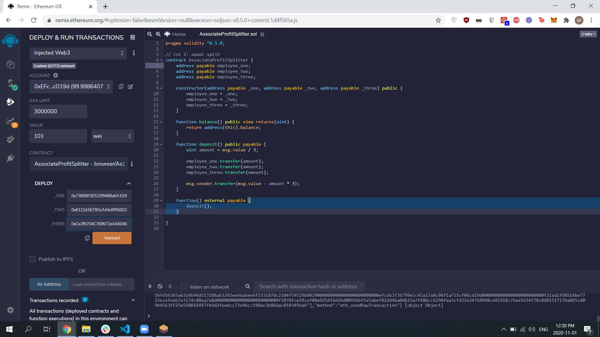
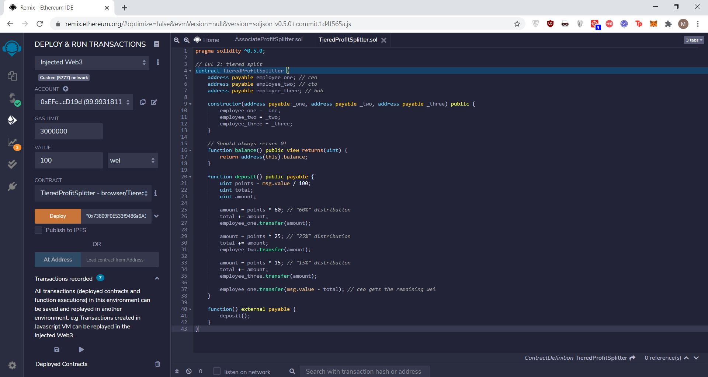
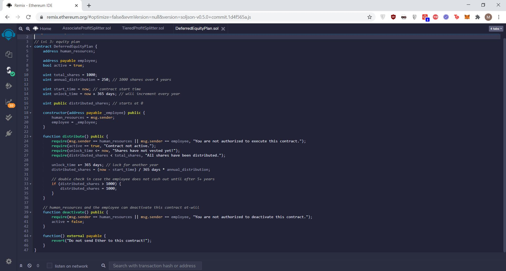
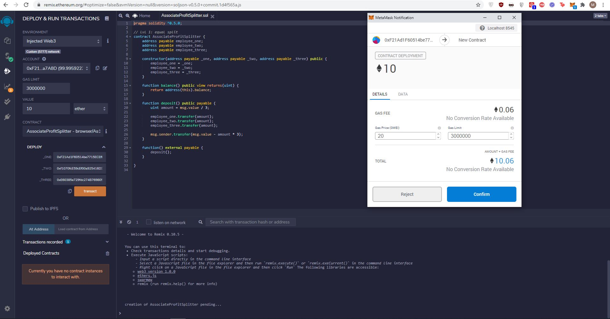
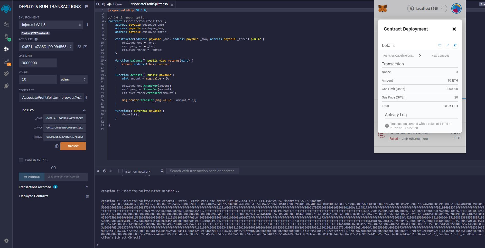

# Solidity-Homework - Unit 20

# Creating smart contracts with Solidity

---

### Homework Assignment

Three part homework assignment:
* **Level One** is an `AssociateProfitSplitter` contract. This will accept ether into the contract, and divide it evenly among associate-level employees. This will allow the human resources department to pay employees quickly and efficiently.

* **Level Two** is a `TieredProfitSplitter` that will distribute different percentages of incoming ether to employees at different tiers/levels. For example, the CEO gets paid 60%, CTO 25%, and Bob gets 15%.

* **Level Three** is a `DeferredEquityPlan` that models traditional company stock plans. This contract will automatically manage 1000 shares, with an annual distribution of 250 shares over four years for a single employee.

---

## Files

* [`AssociateProfitSplitter.sol`](Codes/AssociateProfitSplitter.sol)

* [`TieredProfitSplitter.sol`](Codes/TieredProfitSplitter.sol)

* [`DeferredEquityPlan.sol`](Codes/DeferredEquityPlan.sol)

---

### Screenshots 

Created a custom testnet blockchain with nodes and completed a testnet transaction. 

AssociateProfitSplitter

AssociateProfitSplitter

DeferredEquityPlan

 
---

### Errors Receiveds 

During my project activity, I received 'Gas estimation - Failed gas estimation causes JSON-RPC error' that did not allow me to explain the testnet and share the testnet address.

Submit Transaction request 

Gas Estimation error

--

### Suggested Troubleshooting steps taken (no success)

The closest troubleshooting information I could find (with assistance from the TAs) is the following link:

https://github.com/MetaMask/metamask-extension/issues/7286

The suggested steps however proved to either not work or were too advanced for my technical skills.
* reset metamask
* logging on and off from remix.ethereum.org 
* reset ganache 